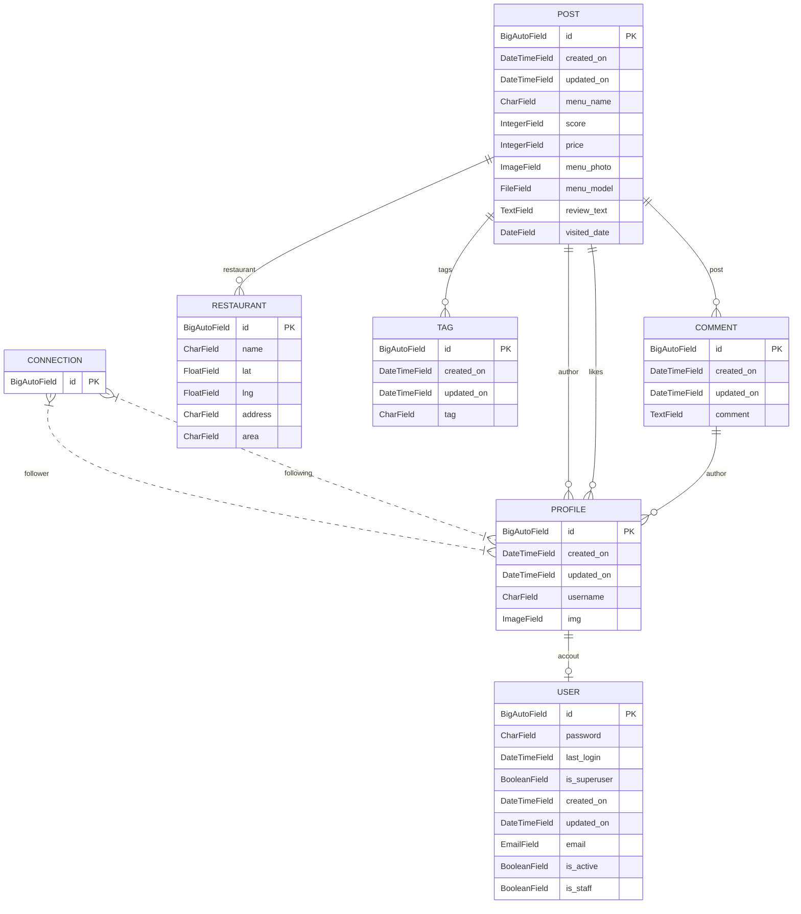

# api-MeAR
~MeAR~ 3Dで見るグルメレビューアプリのバックエンド
# 📗Document
[セットアップ](docs/docker&djnago-setup.md)
# ER図

# エンドポイント
| カテゴリ | HTTPメソッド | エンドポイント | 説明 |
| --- | --- | --- | --- |
| ユーザーアカウント管理 | GET | /account/ | アカウント一覧取得 |
|  | GET | /account/{id} | アカウント詳細取得 |
|  | PUT | /account/{id}/ | アカウント更新 |
|  | PATCH | /account/{id}/ | アカウント一部更新 |
|  | DELETE | /account/{id}/ | アカウント削除 |
| ログイン・新規登録 | POST | /account/ | プロフィール情報を含めた新規ユーザを作成する |
|  | POST | /login/ | メールアドレスとパスワードで認証を行う |
| ユーザー情報管理 | GET | /account/me/ | ログインユーザーのアカウント情報を取得する |
|  | PATCH | /account/me/ | メールアドレスを変更する |
|  | POST | /account/me/change_password/ | パスワードを変更する |
| プロフィール管理 | GET | /profile/ | プロフィール一覧取得 |
|  | GET | /profile/{id}/ | プロフィール詳細取得 |
|  | PATCHE | /profile/{id}/ | プロフィール一部更新 |
|  | GET | /profile/me/ | ログインユーザーのプロフィール取得 |
|  | PATCH | /profile/me/ | ログインユーザーのプロフィール一部更新 |
| フォロー機能 | POST | /profile/{id}/follow/ | プロフィールのフォロー |
|  | DELEAT | /profile/{id}/follow/ | プロフィールのフォロー解除 |
| トークン関連 | POST | /token/refresh/ | refreshトークンを用いて再発行 |
|  | POST | /token/verify/ | tokenが有効かどうかを確認 |
| 投稿管理 | GET | /post/ | 投稿一覧取得 |
|  | POST | /post/ | 投稿作成 |
|  | GET | /post/{id}/ | 投稿詳細取得 |
|  | PATCH | /post/id}/ | 投稿一部更新 |
|  | DELETE | /post/{id}/ | 投稿削除 |
| タグ | GET | /post/tags/ | タグ一覧の取得 |
| コメント | GET | /post/{id}/comment/ | 投稿のコメントを取得 |
|  | POST | /post/{id}/comment/ | 投稿にコメントを作成 |
| いいね | POST | /post/{id}/like/ | 投稿にいいねを追加 |
|  | DELETE | /post/{id}/like/ | いいねを解除 |
